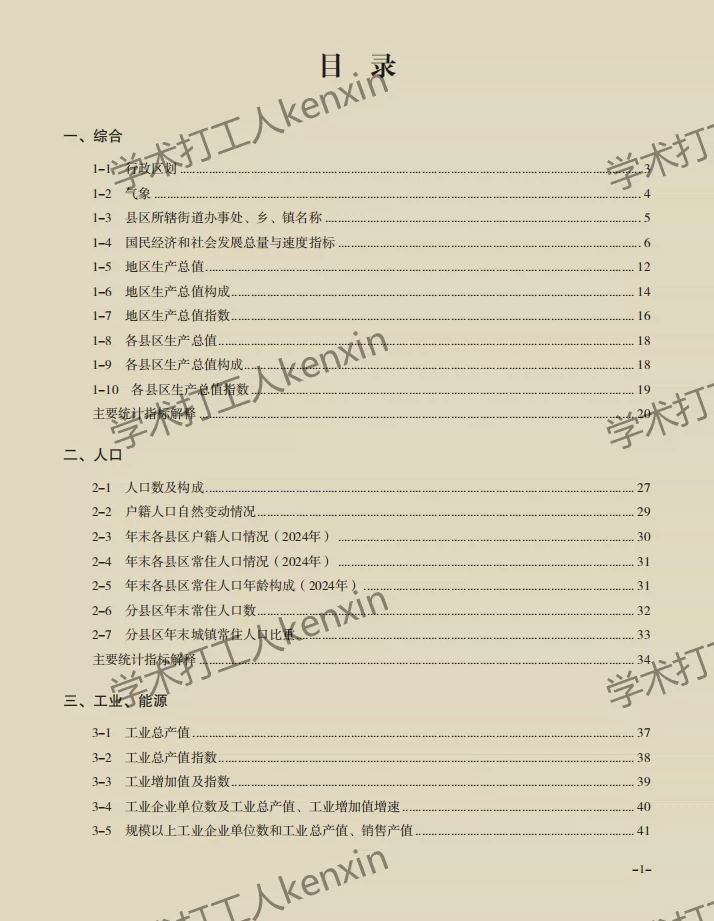
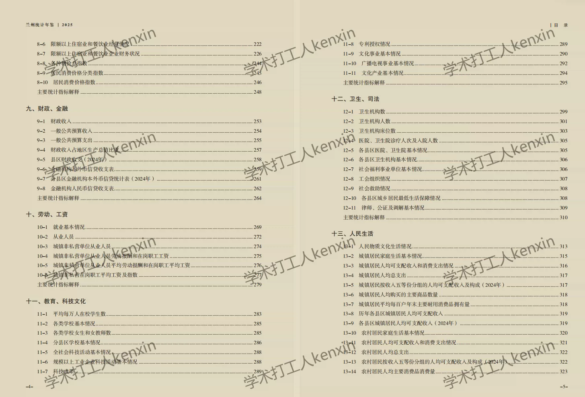
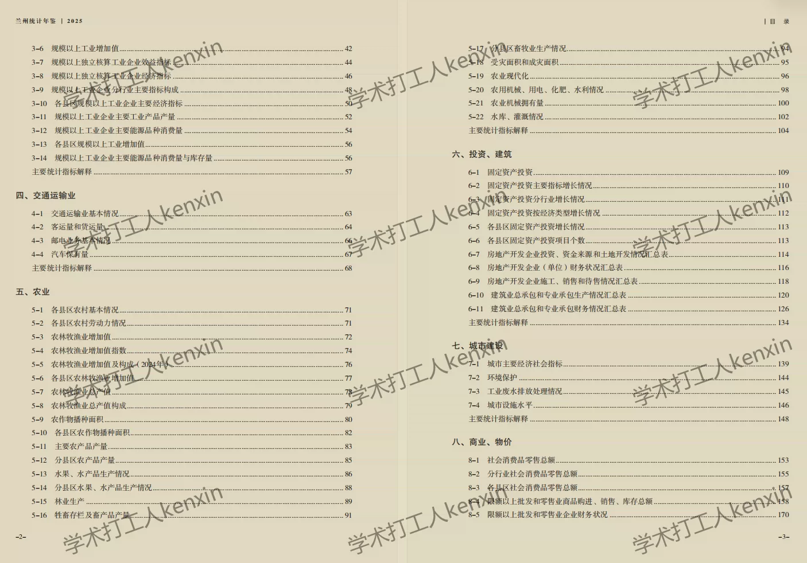
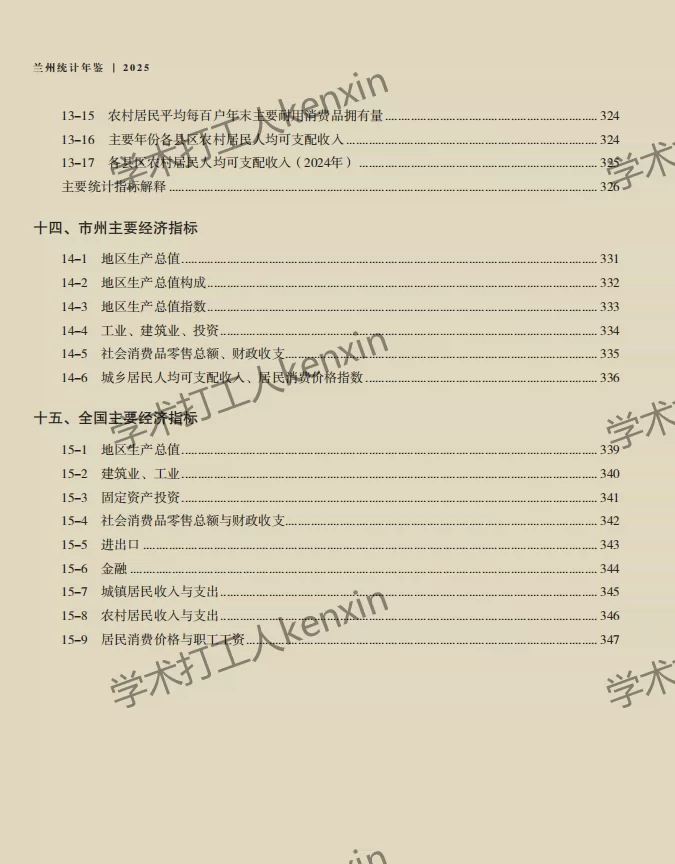

## Body

"Lanzhou Statistical Yearbook" (2001-2025)

Data Year: The title year is the year the data was compiled, while the Data Year refers to the year before the publication of the Yearbook.
For other prefecture-level cities in Gansu, please contact us separately for more information.
Please note the following details and pictures before purchasing. Make sure you are satisfied with the product before purchase! No returns or exchanges will be accepted after shipment.

01. Data Introduction
"Lanzhou Statistical Yearbook" (2001-2025)

02. Indicator Details
(1) The directory is displayed in the picture for reference only. The actual content of the Yearbook may vary. Please view it independently and make your purchase accordingly. We do not assist in finding specific indicators; all information is here. After shipment, we do not support returns due to any reason. If you have any concerns, please do not purchase.
(2) The display directory is for 2025, and due to space limitations, only a portion is shown. The statistical methods may change from year to year. Academic knowledge: The data recorded in statistical materials is the data from the previous year, which is also an academic fact. This is known to everyone.
(3) If the material is placed in a zipped package, you need to save the zipped file first, then download, and finally unzip it.

## Images

Here is a pay link on Stripe ( https://buy.stripe.com/3cs8yP7sY87d0vu9AB ). Please contact me lonlonago@foxmail.com after funding $89, and I will send you a complete data files , thank you!

